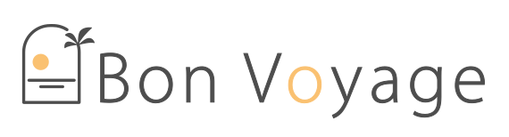

# 


<br>

## 📝프로젝트 소개

- 여행자들이 여행 일정을 쉽게 계획하고 관리 할 수 있는 서비스 제공
- 대시보드를 사용해 구체적인 목표, 기간을 설정
- 초대 기능과 컬럼별 댓글 기능을 통해 여행 구성원 모두가 재밌게 계획할 수 있도록 제작


  <br>

## 🔗배포 링크

- [Bon Voyage 사이트]()(사이트 들어갈곳)

   <br>
- [Bon Voyage 문서](https://www.notion.so/9141e3ca4db0413e8ea89708fc51ebf1?v=5b1a6a388e5c479885b23bd9678d442a)


  <br>

## 👨‍👩‍👧‍👦 3학년 1반 멤버

<table>
  <tbody>
    <tr>
      <td align="center">
        
        <a href="https://github.com/jihee1103"><br /><sub><b>반장 - </b>최지희</sub></a><br />
      </td>
      <td align="center">
        
        <a href="https://github.com/samacyeou"><br /><sub><b></b>김범주</sub></a><br />
      </td>
      <td align="center">
        
        <a href="https://github.com/jinahp"><br /><sub><b></b>박진아</sub></a><br />
      </td>
      <td align="center">
        
        <a href="https://github.com/jinyoung1018"><br /><sub><b></b>백진영</sub></a><br />
      </td>
      <td align="center">
        
        <a href="https://github.com/jiyong0106"><br /><sub><b></b>박지용</sub></a><br />
      </td>
  </tbody>
</table>

  <br>
  
## ⭐ 역할 분담

✈️ 최지희

- 주요기능 적기

✈️김범주

- 주요기능 적기

✈️박진아

- 주요기능 적기

✈️ 백진영

- 주요기능 적기

✈️ 박지용

- 계정관리 및 랜딩 페이지 구현
- 공용 컴포넌트 (버튼) 구현

  <br>

## 📺 기능 시연
- 기능 시연 동영상 들어갈 곳
  <br>

## 🖥️ Dev Tools
 
  
  
  
  
  
  


  <br>

## 🌳 폴더 구조

```bash
Bon Voyage
│
├── public
│   ├── assets             - image, icon 모음
├── src
│   ├── type               - 컴포넌트의 type 모음
│   ├── api                - axios, api 객체 저장소
│   ├── components         - 공용 컴포넌트, 페이지 컴포넌트 모음
│   ├── hooks              - logic 모음
│   ├── pages              - 페이지 모음
│   ├── styles             - SCSS 전역 파일
│   └── utils              - 재사용되는 유틸 함수 모음

```

  <br>

## ❓ Getting Started

```bash
git clone https://github.com/TravelScheduleService/BonVoyage.git

npm i

npm run dev
```
